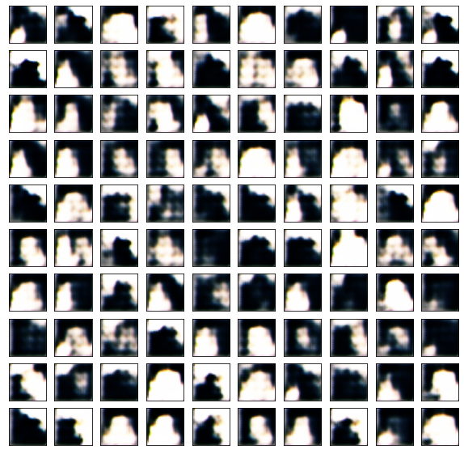

# AKT3ILV_CatGants

# Dataset
Only the cat pictures are taken from the following dataset: 
https://www.kaggle.com/datasets/shaunthesheep/microsoft-catsvsdogs-dataset

Images are resized to 32x32 in a preprocessing step and converted into color images into .JPEG format for consisten format.

# Results
After 100 epochs silhouets of cats can be seen. Results could be improved by using a more fitting dataset because in the current on there only very little images with a full portrait of a cat. In some images also other things like door or windows are included which can influence the model in training.
